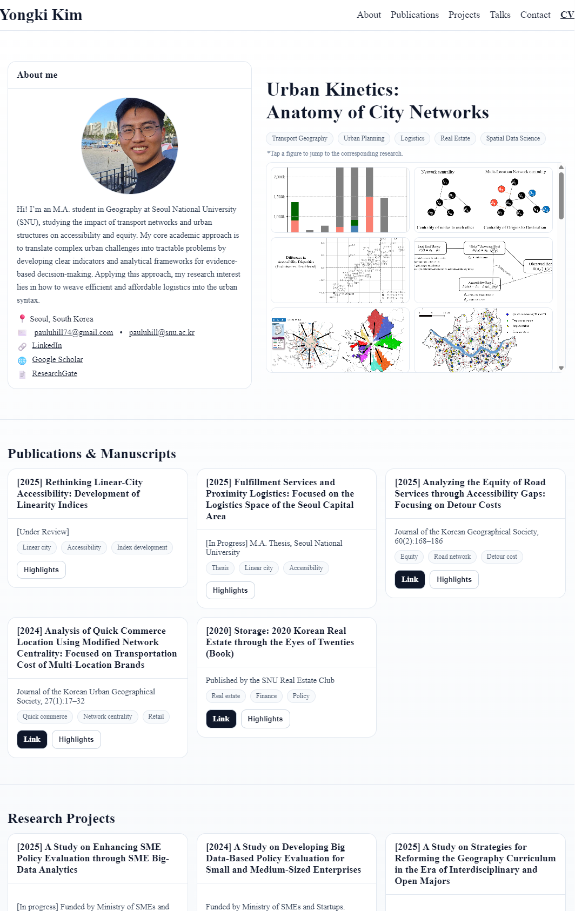

# personal-homepage

---

📝 License  
This template is provided freely for academic & personal use.  
You may adapt and redistribute with attribution. (MIT recommended, or adjust as needed.)

---

👤 Author  

**Yongki Kim (김용기)**  
📍 Seoul, Republic of Korea  
🔗 [Website](https://kim-yongki.github.io/personal-homepage/) | [Google Scholar](https://scholar.google.com/citations?user=G-AE3o0AAAAJ&hl=ko&oi=ao) | [GitHub](https://github.com/kim-yongki)

 
